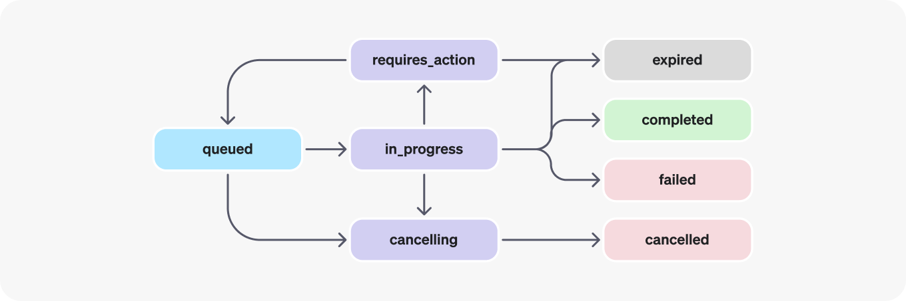

# to do
* Create/finish way to update the knowledge base -> have it well documented and easily usable for anyone 
    * created update_files.py for files and update_assistant.py to update assistant description
* Update knowledge base pdf to include more information -> such as FTEs, map with where are rooms, tools, etc. 
* Add way to exit the bot/finish 
    * 
* Integrate with STT and TTS and wake-up word 
    * check out talk_functions.py, seems to do what it needs to kind of 
* Document everything 
    * this readme lol


# Co-Lab Telephone Assistant
Welcome to the Co-Lab's telephone assistant! This project is meant to serve as a conversational question-answering bot to which any student can ask questions about the Co-Lab, such as its facilities, tools, and workers. This project consists of two main parts:
1. Azure AI Speech: used for speech-to-text and text-to-speech interaction
2. OpenAI Assistants: used to generate answers to questions

## Testing Combined Project
To test the combined project that uses both Azure and OpenAI together for a talking question-answering bot, use this command: 
```
python /home/colabdev/Desktop/telephone-assistant/assistant/talk_functions.py
```

## Part 1: Azure AI Speech
We originally planned to use Azure AI services for both STT/TTS and question answering. however, 

Documentation for the Speech SDK can be found here: https://azure.microsoft.com/en-us/products/ai-services/ai-speech/. 

## Part 2: OpenAI Assistants 
To test just the OpenAI Assistant without the use of TTS/STT, use this command: 
```
python /home/colabdev/Desktop/telephone-assistant/assistant/functions_test2.py
```
To modify the assistant, one can change the description of the assistant and/or its functions, or one can change the file(s) the assistant uses as its knowledge base. These two options can be found in the files `update_assistant.py` and `update_files.py`.

<!--  -->
### How It Works
The following chart represents how the Co-Lab assistant pipeline works. To answer questions, the assistant first creates a thread, to which messages (questions) can be appended and a run (answer generation) can start. Using the different status of an assistant's run object, the assistant can then know whether it needs to function call (request data from an API) to add real-time information to its answer, such as who is currently on shift. Only after the run status is completed does the answer get printed. This question-answering cycle should continue until the user asks no more questions, though the exiting process is still being worked on.


Documentation for OpenAI Assistants can be found here: https://platform.openai.com/docs/assistants/overview. 

### Known Bugs 
There are errors with the assistant recognizing when a function call is necessary. For example, if you ask, "Where is Lily?", the assistant with think Lily is a person (rather than the library) and call the function. 