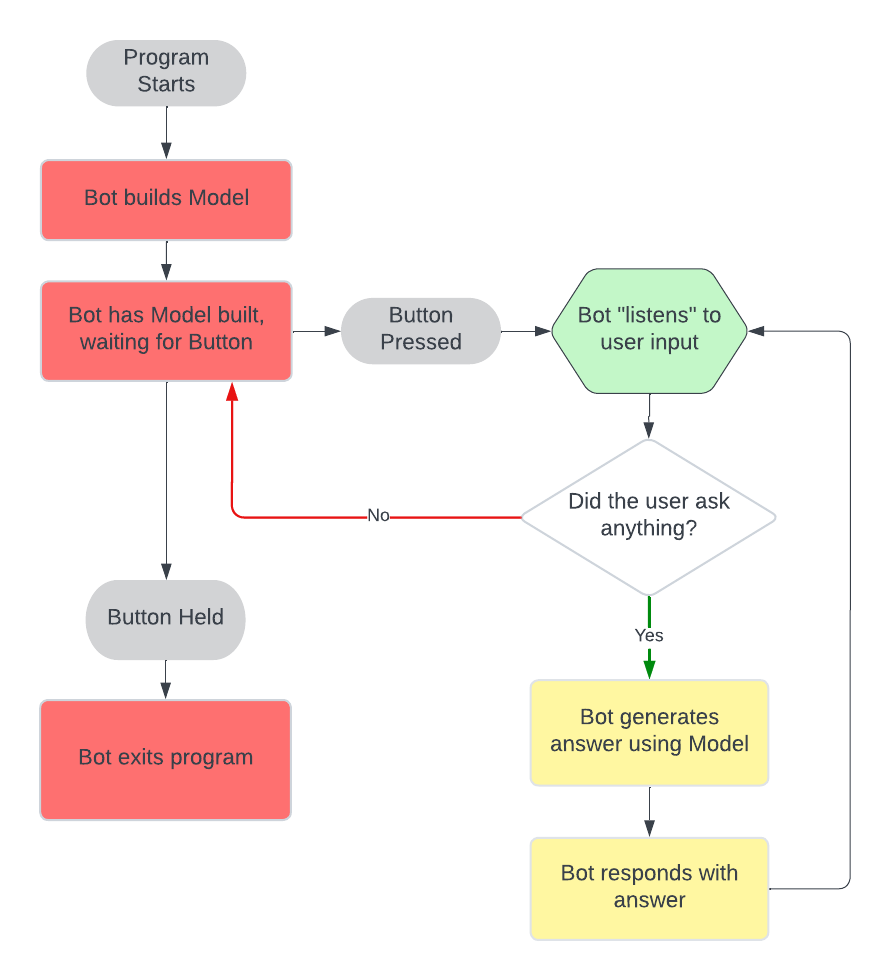

# Co-Lab Telephone Assistant

Welcome to the Co-Lab's Telephone Assistant! This project is meant to serve as a conversational Question-Answering Bot to which any student can ask questions about the Co-Lab, such as its facilities, tools, workers, and upcoming classes.

This project consists of two main parts:

1. Azure AI Speech: used for speech-to-text and text-to-speech interaction

2. Question-Answering Bot: used to build answers to questions

To learn more about the creation/use process of these technologies, go down to "Part 1" and "Part 2" respectively (after Getting Started).

## Getting Started

Before starting, it is important to mention that this project requires both the Azure Language Service and OpenAI API keys to be in your device's OS in order to work. If you don't have one, then this project **will not work**.

### Set Up the Virtual Environment

First, to run the project, it is necessary to both activate the virtual environment and move inside the project directory. The location of the project may vary depending on where you cloned it, but you must run all commands in the directory that contains the project.

You can move into the project directory by running the following command:

```bash
cd /telephone-assistant
```

From here, activate the virtual environment:

```bash
source openai-env/bin/activate
```

### Install Requirements

Next, to confirm the program can execute as expected, run the following command to install required packages:

```bash
pip install -r requirements.txt
```

### Testing Combined Project

To test the combined project (using both Azure and the question-answering bot together), first confirm a speaker is turned on and plugged into the Raspberry Pi. The microphone should already be attached to the Pi. When speaking to ask a question, make sure to hold up the Pi and talk directly into the microphone.

Once both the speaker and microphone are ready, run the program using the following command:

```bash
python ./led/led_stt.py
```

You should now be able to ask questions and recieve answers about anything related to the Co-Lab!

## How Does the Question-Answering Work?

This following chart represents the Co-Lab assistant pipeline. First, the question is translated from Speech-To-Text (STT) and converted into a vector. Then, a vector search is used to find a part of the text that has a close relationship with the question, which is then labeled as context. The context and question are sent to the large language model (OpenAI), which generates an answer. Finally, the answer is returned and the process is repeated.

Currently, we are also testing some hardware additions that visually represent the Question-Answering process, such as a button to start the bot and some LEDs to represent which stage of answering the bot is currently is. 

[](./media/taflowchart.png)

When running led_stt.py (the complete project), this is what each LED represents:

* Red: The bot has finished set-up and is waiting for the user to start (press the button).
* Yellow: The bot is thinking (generating an answer) OR currently responding with an answer.
* Green: The bot is listening for a question.

Pressing the button once will start the bot, and holding the button will have the bot exit.

## Part 1: Azure AI Speech (Previous Testing)

The main functionalities of Azure AI Speech that we are using are its Speech-To-Text (STT) and Text-To-Speech (TTS). In this case, we are using STT to recognize what the user is asking and TTS for the assistant to verbally answer the question.

We originally planned to use Azure AI services for both STT/TTS and question-answering. However, the capabilities of its built in Question Answering feature were not enough. It could only detect question intent and then pair word-for-word an answer to a question as written in whichever PDF we gave.

As a result, we moved to using OpenAI Assistants for generating answers to questions. However, OpenAI Assistants where not cost efficient and had high latency. After investigating other question-answering methods, we decided to use AzureAI just for speech, and moved to creating our own document-based question-answering bot using a vector database, OpenAI, and Langchain as our LLM application framework.

Documentation for the Speech SDK can be found here: <https://azure.microsoft.com/en-us/products/ai-services/ai-speech/>.

## Part 2: Question-Answering Bot

As mentioned before, we are now building our own document-based question-answering bot rather than just using an OpenAI Assistant. To do this, we utilize a vector-search to decrease the latency and increse the accuracy of answers. We are using OpenAI as our large language model (LLM), ChromDB as our vector database, and LangChain Retrieval as the overall framework to build our bot.

By using our OpenAI model as just a LLM and having embeddings be pre-generated and stored in a database, we significantly decrease the usage of our OpenAI model and subsequently its costs. LangChain integrates these embeddings to make a Retrieval Augmented Generation (RAG) application, which we use as our question-answering bot.

This is our current prompt: <https://smith.langchain.com/hub/rngtang/colab-bot?organizationId=5ed40c29-8f7d-47af-ab9b-2c31f51d5ba3>.

The following diagram shows how the application works:

[](./media/bot-diagram.png)

Finally, an introduction to LangChain and its complete possible functionalities can be found here: <https://python.langchain.com/docs/get_started/introduction>. Specifically, we are using LangChain's retrieval module.

## Updating the Knowledge Base

Currently, as laid out in the LangChain Retrieval interface, all of the external context the bot uses to generate answers comes from one PDF file: "/embeddings/files/All_Info.pdf". This PDF is regenerated through the python script "/embeddings/testing/periodic_API.py".

By using Cron on the Co-Lab Raspberry Pi, we have schedule for this script to be continuously run every at XX:00. The output of this script gets piped to "/embeddings/log.txt". This will ensure the knowledge base contains current information about which student workers are on shift and what the first five upcoming Roots classes are.

If you would like to add this job into your device's own cron, you can do so with the following commands. First, in a terminal, open cron:

```bash
crontab -e
```

From here, paste the following command, replacing "your-path-here" with your actual absolute path to the project directory:

```bash
0 * * * * "your-path-here"/telephone-assistant/openai-env/bin/python "your-path-here"/telephone-assistant/embeddings/testing/periodic_API.py >> "your-path-here"/telephone-assistant/embeddings/log.txt
```

Finally, save and exit the cron editor. Now, cron should be automatically running the "periodic_API.py" script every hour.

## Known Bugs

* There are no known bugs, for now...

## Optional/Additional Testing

Here is how to test each component (Azure speech and OpenAI embeddings) separately, as well as how to test a further wake-up word capability.

### Testing Just AzureAI Speech

To test just the AzureAI Speech (STT and TTS), make sure the microphone and speaker are both set up as described above in "Testing Combined Project".

Here, the Question Answering is implemented through AzureAI's Language service, not our created Bot. As a result, the answers generated are not very flexible or complete, as described in "Part 1: Azure AI Speech".

To run the program, use the following command:

```bash
python ./assistant/working/ask.py
```

### Testing Just the Question-Answering Bot

To test just the Question-Answering Bot using your terminal (text input), use this command:

```bash
python ./led/button_led.py
```

This script also has the complete LED and button hardware implementation.

### Additional: Testing the Project with Wake-up Word

This requires hardware (microphone and speaker) to be set up.

To test the combined project (STT/TTS and Question-Answering Bot) integrated with a wake-up word activation rather thn a button, use this command:

```bash
python ./embeddings/testing/wu_stt_embeddings.py
```

The wake-up word is "Hey Colab". Before saying this phrase, the robot will be "awake", but will not respond to questions. This program is not integrated with the LEDs or button.

### Additional: Surprise!

This requires hardware (microphone and speaker) to be set up. For something fun, try running:

```bash
python ./led/surprise.py
```
