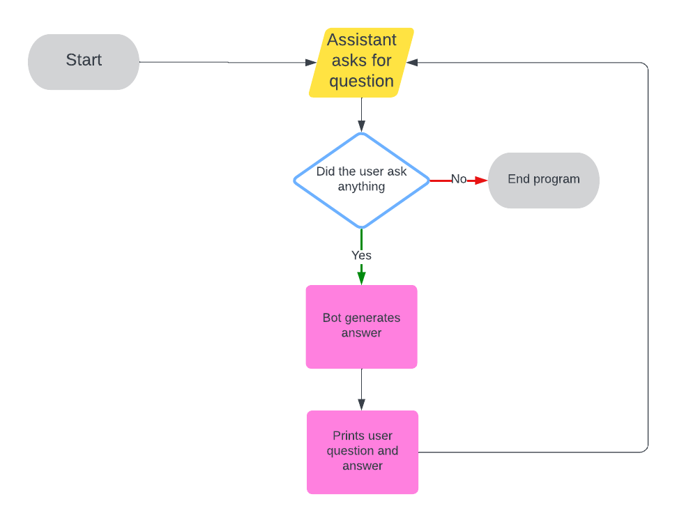
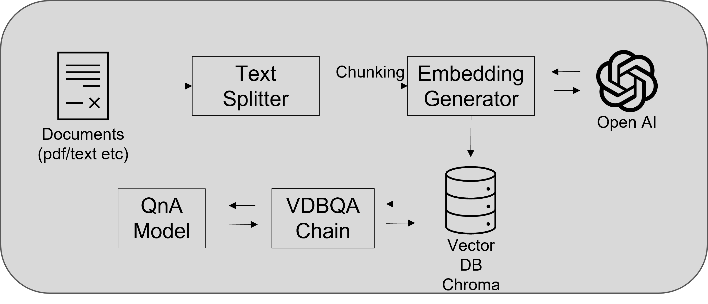

# Co-Lab Telephone Assistant

Welcome to the Co-Lab's Telephone Assistant! This project is meant to serve as a conversational question-answering bot to which any student can ask questions about the Co-Lab, such as its facilities, tools, workers, and upcoming classes.

This project consists of two main parts:

1. Azure AI Speech: used for speech-to-text and text-to-speech interaction

2. Question-Answering Bot: used to build answers to questions

To learn more about the creation/use process of these technologies, go down to "Part 1" and "Part 2" respectively (after Getting Started).

## Getting Started

### Activate the Virtual Environment

In order for the project to work, it is necessary to activate the virtual environment. To do so, run the following command:

```bash
source /home/colabdev/Desktop/telephone-assistant/openai-env/bin/activate
```

### Testing Combined Project

To test the combined project that uses both Azure and the question-answering bot together, first make sure a speaker is turned on and plugged into the Raspberry Pi. The microphone should already be attached to the Pi. When speaking to ask a question, make sure to hold up the Pi and talk directly into the microphone.

Once both the speaker and microphone are ready, run the program using the following command:

```bash
python /home/colabdev/Desktop/telephone-assistant/embeddings/testing/stt_embeddings.py
```

You should now be able to verbally ask questions and recieve answers about anything related to the Co-Lab!

### How Does the Question-Answering Work?

This following chart represents how the Co-Lab assistant pipeline works. First, the question is translated from speech to text and then converted into a vector. Then, a vector search is used to find a part of the text that has a close relationship with the questions, which is labeled 'Context'. Next, the context is sent to our large language model (OpenAI), which generates an answer. Finally, the answer is returned and the process is repeated.



## Part 1: Azure AI Speech

The main functionalities of Azure AI Speech are its speech-to-text (STT) and Text-to-speech (TTS) features that the SDK provides. In this case, we are using STT to recognize what is the user asking and TTS for the assistant to verbally answer the question.

We originally planned to use Azure AI services for both STT/TTS and question answering. However, the capabilities of the Question Answering feature were not enough. It could only detect question intent and then pair word-for-word an answer to a question as written in whichever PDF we gave. As a result, we moved to using OpenAI Assistants for generating answers to questions. However, OpenAI assistants where not cost efficient and had high latency.

After investigating other question-answering methods, we tried creating our own document-based question-answering bot using a vector database, OpenAI, and Langchain as our LLM application framework.

Documentation for the Speech SDK can be found here: https://azure.microsoft.com/en-us/products/ai-services/ai-speech/.

## Part 2: Question-Answering Bot

As mentioned before, we are now using a custom-made document-based question-answering bot. To do this, we implement a vector-search to decrease the latency and increse the accuracy of answers. We are using OpenAI as our large language model (LLM), ChromDB as our vector database, and Langchain Retrieval as the overall framework to build our bot.

By using our OpenAI model as just a LLM and having embeddings be pre-generated and stored in a database, we significantly decrease the usage of our OpenAI model and subsequently its costs. LangChain integrates these embeddings to make a Retrieval Augmented Generation (RAG) application, which we use as our question-answering bot.

The following diagram shows how the bot works:


An introduction to LangChain and its complete possible functionalities can be found here: https://python.langchain.com/docs/get_started/introduction. Specifically, we are using LangChain's retrieval module.

## Updating the Knowledge Base

Currently, as laid out in the LangChain Retrieval interface, all of the external context the bot uses to generate answers comes from one PDF file:

```bash
/home/colabdev/Desktop/telephone-assistant/embeddings/files/All_Info.pdf
```

This PDF is constantly being regenerated every 15 minutes through Cron on the Raspberry Pi. This will ensure the knowledge base contains current information about which student workers are on shift and what the first five upcoming Roots classes are.

## Known Bugs

* There are no known bugs, for now...

## Optional/Additional Testing

Here is how to test each component (Azure speech and OpenAI embeddings) separately, as well as how to test a further wake-up word capability.

### Testing Just AzureAI Speech

To test just the AzureAI Speech (speech-to-text and text-to-speech), make sure the microphone and speaker are both set up (as described above in "Testing Combined Project").

Here, the Question Answering is implemented through AzureAI's Language service, not the Bot. As a result, the answers generated are not very flexible or complete, as described in "Part 1: Azure AI Speech".

To run the program, use the following command:

```bash
python /home/colabdev/Desktop/telephone-assistant/assistant/working/ask.py
```

### Testing Just the Question-Answering Bot

To test just the question-answering Bot using your terminal (text input), use this command:

```bash
python /home/colabdev/Desktop/telephone-assistant/embeddings/testing/embeddings_terminal.py
```

### Additional: Testing the Project with Wake-up Word

Currently, this feature is still in development. It requires the external hardware (microphone and speaker) to be set up.

To test the combined project (STT/TTS and question-answering Bot) additionally integrated with a wake-up word activation, use this command:

```bash
python /home/colabdev/Desktop/telephone-assistant/assistant/working/wake_up.py
```

The wake-up word is "Hey Colab". Before saying this phrase, the robot will be "awake", but will not respond to questions.
